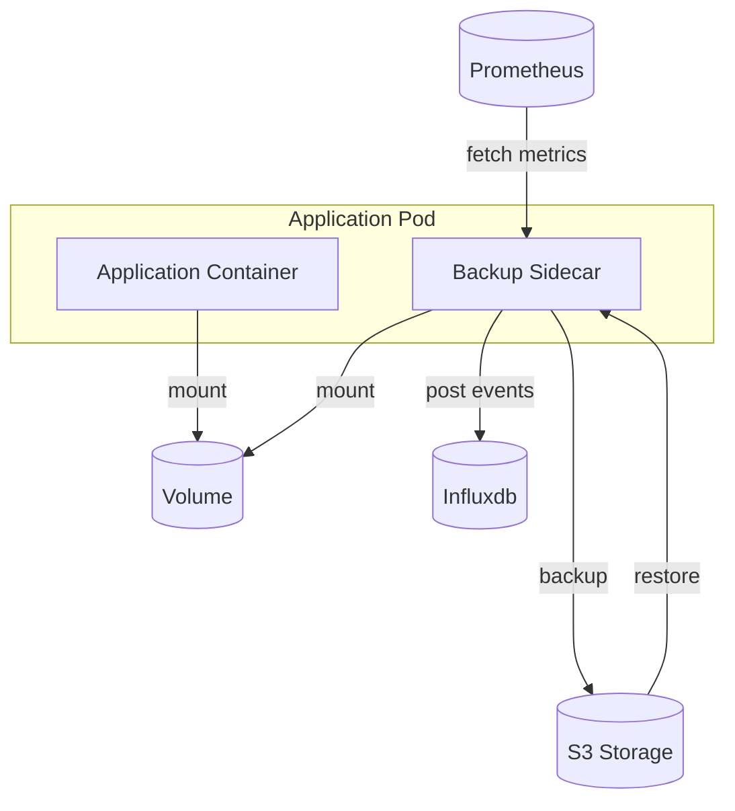

mermaid test paige

```mermaid

graph TB

    subgraph  Application Pod
        app[Application Container]
        mcsbackup[Backup Sidecar]
    end

    volume[(Volume)]
    app-- mount -->volume
    mcsbackup-- mount -->volume

    s3[(S3 Storage)]
    mcsbackup -- backup  ---> s3
    s3  -- restore ----> mcsbackup

    influxdb[(Influxdb)]
    mcsbackup -- post events --> influxdb

    prometheus[(Prometheus)]
    prometheus -- fetch metrics --> mcsbackup


```